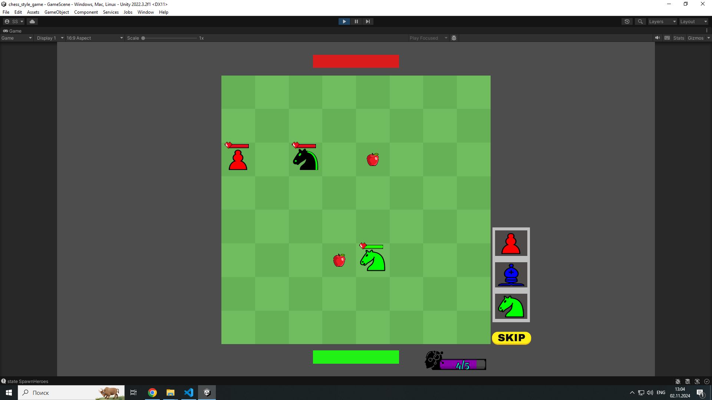

# Частично реализованный проект: Chess Style Game

Данный код результат моей работы в стартап-проекте по созданию компьютерной игрой в пошаговом сидела. Разработка велась 5-6 месяцев, но, к сожалению, проект свернулся.

Проект реализовывался на C#/Unity.

Благодаря данному проекту имею опыт командной разработки. 80% кода, находящегося здесь, разработано с моим участием.